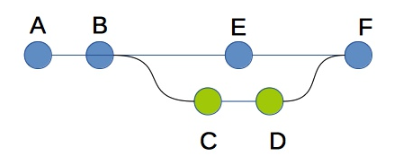

# Tarea: Git Ramas (Basico)
Crea un repositorio y realiza commits para que quede igual que
el gráfico. Los commits _C_ y _D_,
tienen que estar en una rama nueva llamada _exp_.

******
## Solucion

1. Seguimiento del proyecto y GitHub - ***commits: A y B*** :white_check_mark:

   1. Inicializo el seguimiento del proyecto y hago los dos primeros commits.
   2. Subo la carpeta **src** y el fichero **readme.md** a el
      [repositorio de GitHub](https://github.com/acastineiraduran/ramasBasico.git) :link:

2. Nueva rama - ***commits: C*** :white_check_mark:

   1. Creo una nueva rama con el comando ``git branch exp``
      que estará apuntando al commit donde tenga el _HEAD_ <code>#33ffc7c</code>.
   2. Compruebo en que rama estoy utilizando mediante ``git branch`` y
      con `git switch` me muevo a la rama _exp_.
   3. A continuación creo una nueva clase dentro de la
      carpeta _src_ donde haré los cambios que me parezcan oportunos utilizando
      esa nueva rama que he creado para evitar posibles conflictos. La nueva
      clase se llamará _Implementaciones_.
   4. Añado los cambios y les hago un commit.

3. Cambiamos de rama ***commits: E*** :white_check_mark:
   1. Volvemos a la rama _Main_ para realizar el nuevo commit. Lo hacemos así
      para que quede como en el dibujo, es decir un commit en la _Main_ entre los
      commit _C_ y _D_.

4. Volvemos rama experimental ***commits: D*** :white_check_mark:
   1. Volvemos de nuevo a la rama _exp_ para hacer el ultimo commit de la misma.
   2. Nos podemos ayudar del comando ``git log --oneline --decorate --graph --all``
      para ir siguiento el proceso de manera más visual.
   3. Cuando cambiamos de ramas tenemos que tener todo lo que hemos
      modificado guardado ya que si no se perderá. En vez de hacer un commit,
      ya que el código no está completo, nos puede ayudar el comando ``git stash``
      para guardar para guardar temporalmente estas modificaciones. Cuando
      regresemos a la rama simplemente escribimos ``git stash pop`` para
      implementarlos de nuevo.

5. Mergeamos las ramas ***commits: F*** :white_check_mark:
   1. Volvemos a la rama _main_ y ejecutamos el comando `git merge exp`.
      Esto va a provocar que, si no hay conflictos, se implemente el codigo
      de la rama _exp_ en la rama _main_.
   2. Realizaremos un último commit con los nuevos cambios incorporados.
