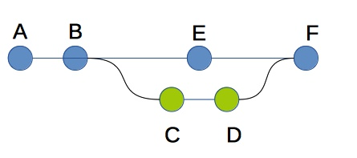

# Tarea: Git Ramas (Basico)
_Crea un repositorio y realiza commits para que quede igual que
el gráfico. Los commits 'C' y 'D',
tienen que estar en una rama nueva llamada 'exp'._

1. Seguimiento del proyecto y GitHub - ***commits: A y B*** :white_check_mark:

   1. Inicializo el seguimiento del proyecto y hago los dos primeros commits.
   2. Subo la carpeta **src** y el fichero **readme.md** a el
   [repositorio de GitHub](https://github.com/acastineiraduran/ramasBasico.git). :link:

2. Nueva rama ***commits: C*** :white_check_mark:

   1. Creo una nueva rama con el comando ``git branch exp`` 
      que estará apuntando al commit donde tenga el 'HEAD' <code>#33ffc7c</code>.
   2. Compruebo en que rama estoy utilizando mediante ``git branch`` y 
   con `git switch` me muevo a la rama 'exp'. 
   3. A continuación creo una nueva clase dentro de la 
      carpeta 'src' donde haré los cambios que me parezcan oportunos utilizando 
      esa nueva rama que he creado para evitar posibles conflictos. La nueva 
   clase se llamará 'Implementaciones'. 
   4. Añado los cambios y les hago un commit.
